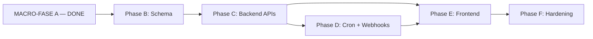

# Relitrue EPIC — Execution Plan

> **Version:** 1.0 — 2026-04-29  
> **Status:** Active  
> **Master Plan reference:** [00-master-plan.md](./00-master-plan.md)  
> **Implements docs:** 01-06

## Section 1 — Overview

- ~52 prompts across 5 macro-phases (B–F) was the initial macro estimate; this document refines to **46 primary prompts** (Section 10 reconciles the delta).
- Each phase follows the pattern proven in **MACRO-FASE A**: focused recon → plan → agent execution.
- **Integration tests** are mandatory **only** for D-009 features: assignment engine, delegations, webhooks, approval routing (tenant isolation critical paths).
- **Feature flags** apply **only** to D-010 high-risk features: assignment engine, webhooks (per-tenant activation where used).

Cross-cutting gates (every phase):

- `tsc --noEmit` clean, `npm run build`, unit suite non-regressing, tenant isolation preserved, Zod on APIs, audit logs where sensitive.

Document map (implementation order of specs):

| Doc | Topic |
| --- | --- |
| [01-access-model.md](./01-access-model.md) | 4-axis RBAC, membership + invitation |
| [02-finance-teams.md](./02-finance-teams.md) | FinanceTeam, members, workload counter |
| [03-assignment-engine.md](./03-assignment-engine.md) | Assignment rules, engine, queue, evaluations |
| [04-delegations-ooo.md](./04-delegations-ooo.md) | Availability, delegations, HYBRID handoff |
| [05-webhooks.md](./05-webhooks.md) | Endpoints, signing, delivery, retries |
| [06-approval-routing.md](./06-approval-routing.md) | Approval rules, sequential mode, evaluations |

Prompt sizing convention:

- One prompt should complete a reviewable PR-sized unit (schema slice, service + tests, or API surface + tests).
- If a prompt balloons, split by migration vs. API vs. tests in follow-up prompts within the same phase.

## Section 2 — Phase B: Schema Enterprise + Access Model

10 prompts. Schema-first phase — minimal logic, maximum Prisma changes.

| Prompt | Title | Scope | Doc Ref |
| --- | --- | --- | --- |
| B1 | Recon current schema | Verify state of TenantMembership, TenantInvitation, related models | All |
| B2 | Add 4-axis enums + TenantMembership fields | WorkspaceRole, FinancialAccessScope, FinanceResponsibility, BillingAccessLevel + 4 fields on TenantMembership | 01 |
| B3 | TenantInvitation 4-axis fields + backfill migration | Same fields + backfill from existing TenantUserRole | 01 |
| B4 | MembershipAvailability enum + TenantMembership availability fields | availability, availabilityReason, unavailableUntil | 04 |
| B5 | FinanceTeam + FinanceTeamMember models | Plus financeOpenAssignmentsCount on TenantMembership | 02 |
| B6 | TenantFinanceSettings + delegation policy enum | Per-tenant config | 04 |
| B7 | ApprovalDelegation model + RecordParticipant delegate fields | Delegation state machine + extension | 04 |
| B8 | Finance Assignment models | FinanceAssignmentRule, FinanceAssignmentRuleCondition, FinanceAssignmentEvaluation, Record finance fields, FinanceStatus enum | 03 |
| B9 | Approval Routing models | ApprovalRoutingRule, conditions, approvers, evaluations, PENDING_BLOCKED enum extension | 06 |
| B10 | Webhook models | WebhookEndpoint, WebhookDelivery, status enums | 05 |

Phase B notes:

- One migration per feature area where possible; avoid mixed unrelated schema in a single migration file.
- Backfill scripts run after additive columns exist; validate on empty DB and seeded DB before merge.

B-phase exit checklist:

- [ ] Prisma schema compiles; `prisma migrate status` up to date locally.
- [ ] No `db push` in workflow; only `migrate dev` / deploy migrations.
- [ ] Foreign keys and `onDelete` behaviors match docs (Cascade vs Restrict vs SetNull).
- [ ] Indexes from specs present for tenant-scoped hot paths.
- [ ] At least one integration test harness smoke if B touches isolation-critical tables (optional mini-smoke until C).

Per-prompt deliverables (B):

| Prompt | Primary output |
| --- | --- |
| B1 | Written recon notes: current vs target schema gaps |
| B2 | Migration + enum definitions + TenantMembership columns |
| B3 | Invitation columns + SQL/TS backfill + validation queries |
| B4 | Availability enum + membership columns + index |
| B5 | FinanceTeam + FinanceTeamMember + counter field |
| B6 | TenantFinanceSettings model + policy enum |
| B7 | ApprovalDelegation + RecordParticipant FK fields |
| B8 | Assignment rule + condition + evaluation + Record finance columns |
| B9 | Approval routing models + participant status enum extension |
| B10 | WebhookEndpoint + WebhookDelivery + enums |

## Section 3 — Phase C: Backend APIs

14 prompts. Service layer + route handlers.

| Prompt | Title | Doc Ref |
| --- | --- | --- |
| C1 | 4-axis hasAccess() helper + permission resolution algorithm | 01 |
| C2 | Members API with 4-axis updates + forbidden combinations validation | 01 |
| C3 | TenantInvitation acceptance handler propagating 4-axis | 01 |
| C4 | FinanceTeam CRUD endpoints | 02 |
| C5 | FinanceTeamMember add/remove endpoints + counter increment | 02 |
| C6 | FinanceAssignmentRule CRUD | 03 |
| C7 | Finance Assignment Engine service (pure conditions + reconciler) | 03 |
| C8 | Hook from A4 reconciler to assignment engine on FULLY_APPROVED | 03 |
| C9 | Finance Queue endpoints (start, complete, release) | 03 |
| C10 | Reassignment + manual evaluation endpoints | 03 |
| C11 | recomputeFinanceStatus reconciler | 03 |
| C12 | ApprovalRoutingRule CRUD + sub-endpoints (conditions, approvers) | 06 |
| C13 | Approval Routing Engine + A4 reconciler integration with PENDING_BLOCKED | 06 |
| C14 | Manual re-evaluation endpoint for routing | 06 |

Phase C notes:

- Route Handlers only (no Server Actions); all mutations via `src/app/api/**/route.ts`.
- D-009 integration tests land alongside C7–C8, C13, and webhook/delegation paths when those APIs exist.

C-phase dependency detail:

- C1 blocks C2–C3 (authorization helper must exist before membership mutations).
- C4–C5 can proceed in parallel with C1–C3 once schema is stable.
- C6–C11 form the assignment vertical: prefer C6 → C7 → C11 before C8 hook to avoid half-wired triggers.
- C12–C14 form the approval routing vertical: C13 requires A4 changes; coordinate with assignment hook to avoid double recompute storms.

Security reminders for C phase:

- Every handler: authenticate, resolve tenant server-side, enforce isolation in queries, return concealed 404s where policy requires.
- Feature flags (D-010): assignment engine and webhooks fail closed when disabled.

Per-prompt deliverables (C):

| Prompt | Primary output |
| --- | --- |
| C1 | `hasAccess` / action router + unit tests |
| C2 | PATCH membership axes + Zod refine + audit |
| C3 | Invitation accept copies 4-axis |
| C4 | Finance team CRUD routes |
| C5 | Member add/remove + visibility rules + counter tx |
| C6 | Assignment rule CRUD |
| C7 | Engine service + snapshot persistence |
| C8 | A4 hook → enqueue/run assignment |
| C9 | Queue start/complete/release |
| C10 | Reassign + manual trigger routes |
| C11 | `recomputeFinanceStatus` service |
| C12 | Routing rule CRUD + sub-resources |
| C13 | Routing engine + A4 `PENDING_BLOCKED` |
| C14 | Manual routing evaluate route |

## Section 4 — Phase D: OOO + Delegations + Webhooks

7 prompts. Cron jobs + async delivery.

| Prompt | Title | Doc Ref |
| --- | --- | --- |
| D1 | Availability API (self-service + admin override) | 04 |
| D2 | Delegation CRUD endpoints with validation | 04 |
| D3 | delegation-activator cron job + HYBRID handoff logic | 04 |
| D4 | delegation-deactivator cron job | 04 |
| D5 | Webhook endpoint CRUD + secret rotation | 05 |
| D6 | Webhook delivery worker + exponential backoff | 05 |
| D7 | reconcile-finance-counters nightly job + auto-disable webhooks job | 02, 05 |

Phase D notes:

- Cron registrations must be idempotent and manually triggerable in non-production for verification.
- Webhook worker respects plan downgrade and endpoint auto-disable (doc 05).

D-phase operational readiness:

- Document manual cron triggers in `src/test` or admin-only internal routes (pattern from existing jobs).
- Verify HYBRID handoff under transaction with integration test (D-009).
- Webhook: verify signing header round-trip against receiver example doc (Phase D deliverable in doc 05).

Per-prompt deliverables (D):

| Prompt | Primary output |
| --- | --- |
| D1 | Availability GET/PATCH + admin override route |
| D2 | Delegation POST/GET/DELETE + validation |
| D3 | `delegation-activator` job + notifications |
| D4 | `delegation-deactivator` job + HYBRID apply |
| D5 | Webhook CRUD + rotate secret |
| D6 | `webhook-deliver` worker + backoff + reaper |
| D7 | `reconcile-finance-counters` + webhook auto-disable tuning |

## Section 5 — Phase E: Frontend

10 prompts. UI for all backend features.

| Prompt | Title | Doc Ref |
| --- | --- | --- |
| E1 | Workspace settings: members tab with 4-axis editor | 01 |
| E2 | Invitation flow: 4-axis preset selection | 01 |
| E3 | Finance Teams settings UI | 02 |
| E4 | Finance Team detail + member management | 02 |
| E5 | Finance Assignment Rules editor | 03 |
| E6 | Finance Queue page (assigned records) | 03 |
| E7 | Availability + Delegations settings | 04 |
| E8 | Approval Routing Rules editor | 06 |
| E9 | Webhooks settings + delivery history viewer | 05 |
| E10 | Notifications types extended (delegation, finance, webhook events) | 04, 05 |

Phase E notes:

- Per `ui-ux-contract.mdc`: loading, empty, and error states on major screens (Section 8).
- Server remains source of truth; UI gates are UX-only.

E-phase sequencing suggestion:

- E1–E2 first (access model surfaces everywhere).
- E3–E6 finance ops (teams, rules, queue).
- E7 delegations/availability (depends on D APIs for full fidelity).
- E8 routing editor (admin-heavy).
- E9 webhooks (Enterprise messaging + history).
- E10 notification types last to avoid churn while event names stabilize.

Per-prompt deliverables (E):

| Prompt | Primary output |
| --- | --- |
| E1 | Members table + 4-axis editor + guard rails |
| E2 | Invite form + axis presets |
| E3 | Teams list + create/edit |
| E4 | Team detail + members + lead flags |
| E5 | Assignment rules UI + condition builder |
| E6 | Finance queue list + record actions |
| E7 | Availability + delegation management |
| E8 | Approval routing UI + approver builder |
| E9 | Webhooks list + secret once UX + delivery log |
| E10 | Notification types + bell surfacing |

## Section 6 — Phase F: Hardening

5 prompts. Performance, observability, plan enforcement, final audit.

| Prompt | Title | Scope |
| --- | --- | --- |
| F1 | Plan gating audit (verify all gated features enforce server-side) | All |
| F2 | Observability instrumentation (metrics + alerts) | All |
| F3 | Performance audit (engine timing, query optimization, index review) | 03, 06 |
| F4 | Legacy permission system deprecation (remove TenantRole/TenantRolePermission usage) | 01 |
| F5 | Final integration test sweep + documentation polish | All |

Phase F notes:

- F4 aligns with master plan migration path: legacy permission reads removed only after 4-axis is fully wired and tested.
- F5 includes `docs/epic/` updates if decisions drift during execution.

F-phase deliverable artifacts:

- Written plan-gating matrix (feature × API × worker × UI) with evidence links to code paths.
- Dashboard or log-based proof for webhook success rate and assignment latency (per doc 03/05 observability sections).

Per-prompt deliverables (F):

| Prompt | Primary output |
| --- | --- |
| F1 | Plan gate audit report + fixes |
| F2 | Metrics/alerts wired per specs |
| F3 | Perf report + index/query fixes |
| F4 | Legacy permission removal PR |
| F5 | Integration sweep + doc polish |

## Section 7 — Phase Dependencies



- Phase B is fully sequential (each prompt depends on prior schema).
- Phase C is mostly sequential within feature, but C1–C3 can parallel with C4–C5.
- Phase D depends on Phase C completion.
- Phase E can start partially after Phase C (UI can be built ahead of cron).
- Phase F runs last.

Parallelization guardrails:

- Do not merge schema + heavy engine + UI in one PR; keep phases separable for rollback.
- Shared enums (`ConditionField`, etc.) must merge in B before parallel C work diverges.

## Section 8 — Per-Phase Definition of Done

Same as `00-master-plan.md` Section 7, plus:

- **Phase B**: All migrations applied, `migrate dev --create-only` produces empty migration.
- **Phase C**: Integration tests added for D-009 features.
- **Phase D**: Cron jobs registered + manually triggerable for testing.
- **Phase E**: All UI screens have loading/empty/error states (per `ui-ux-contract.mdc`).
- **Phase F**: Master Plan docs updated if any architectural decision shifted.

Additional verification hooks:

- **Phase C/D**: `npm run test:integration` green for D-009 suites where applicable.
- **Phase B/C**: `npx prisma migrate dev --create-only --name drift_check` → empty migration, then delete folder.
- **Phase F**: grep passes for forbidden patterns (e.g. client-trusted tenant id in new handlers).

## Section 9 — Risk Register

| Risk | Probability | Impact | Mitigation |
| --- | --- | --- | --- |
| 4-axis backfill breaks existing memberships | Medium | High | DB is empty in dev; staging migration test mandatory |
| Assignment engine performance at scale (1000+ rules) | Low | High | Plan limit caps at 100 rules; performance tests in F3 |
| Webhook receivers DDoS (slow/unresponsive) | Medium | Medium | 5s timeout; auto-disable after 100 failures |
| Delegation circular reference detection | Low | Medium | Validation at create time + integration test |
| HYBRID handoff race condition | Medium | High | Single transaction; pessimistic lock on records |
| Sequential approval chain stuck | Medium | Medium | Escalation policy + admin override endpoint |
| Cron job missing tick (downtime) | Low | Low | Workers idempotent; next tick recovers |

Residual risks (monitor during execution):

| Risk | Probability | Impact | Mitigation |
| --- | --- | --- | --- |
| Spec drift between docs 01–06 and code | Medium | Medium | Update `docs/epic/` in F5 when decisions change; link PRs to doc sections |
| Notification enum churn breaks clients | Low | Medium | Version notification payloads; batch E10 after event names stable |
| Dual write period (legacy + 4-axis) confusion | Medium | High | Explicit `hasAccess` fallback order documented in C1; remove in F4 |

## Section 10 — Estimated Timeline

| Phase | Prompts | Cursor time | Dev validation time | Total |
| --- | --- | --- | --- | --- |
| B | 10 | ~5 hours | ~2 hours | ~7 hours |
| C | 14 | ~14 hours | ~5 hours | ~19 hours |
| D | 7 | ~10 hours | ~3 hours | ~13 hours |
| E | 10 | ~15 hours | ~5 hours | ~20 hours |
| F | 5 | ~5 hours | ~3 hours | ~8 hours |
| **Total** | **46** | **~49h** | **~18h** | **~67h (~6-9 weeks)** |

NOTE: 46 prompts; the prior estimate of "52" assumed extra recon prompts per phase (now embedded in primary prompts).

Calendar framing:

- **~67 hours** of focused execution maps to **6–9 weeks** with reviews, meetings, and staging validation — not continuous Cursor time.
- Reserve buffer after B2–B3 for migration rehearsal on a production-sized snapshot (anonymized).

## Section 11 — Working Method

Reuse the pattern that worked for MACRO-FASE A:

1. **Recon prompt** (Ask mode) — focused read-only inspection.
2. **Plan prompt** (Plan mode) — Cursor proposes implementation, reviewer approves.
3. **Approval prompt** (Agent mode) — execution with explicit clarifications.
4. **Verification** — TypeScript clean + tests pass + drift check + grep verifications.

For low-risk phases (e.g., simple CRUD), can skip Plan and go Recon → Agent.

PR hygiene:

- Title format: `[EPIC B3] TenantInvitation 4-axis + backfill` (phase + prompt id).
- Description must list: risk, rollback, migrations, tests run (`npm test`, `test:integration` if touched).
- Never commit `.env`; use existing env validation module for new variables.

Review focus by phase:

- **B**: schema diff, indexes, onDelete, backfill correctness.
- **C**: authz, Zod, audit logs, isolation tests.
- **D**: idempotent crons, job failure modes, secrets handling for webhooks.
- **E**: UX states, no client-side authority.
- **F**: plan matrix, perf evidence, deprecation completeness.

## Section 12 — Changelog

```markdown
| Version | Date | Change |
|---|---|---|
| 1.0 | 2026-04-29 | Initial execution plan — 46 prompts across 5 macro-phases |
```
