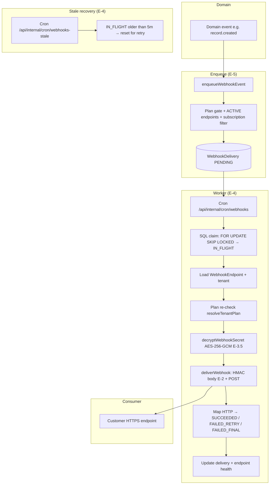

# MACRO-FASE E: Outbound Webhooks — Implementation Summary

> **Document type:** MACRO-FASE close-out / audit trail / production handoff  
> **Status:** Complete (E-Setup → E-8; **this file = E-9**)  
> **Related:** [05-webhooks.md](./05-webhooks.md), [11-e-spike-webhooks-foundations.md](./11-e-spike-webhooks-foundations.md), [09-d-spike-ui-patterns.md](./09-d-spike-ui-patterns.md), [10-macro-fase-d-summary.md](./10-macro-fase-d-summary.md), [00-master-plan.md](./00-master-plan.md)  
> **Scope:** **Outbound tenant webhooks** (Relitrue → customer HTTPS). **Not** Paddle inbound billing webhooks (**E-004**).

---

## Table of contents

1. [Executive summary](#1-executive-summary)
2. [Architecture overview](#2-architecture-overview)
3. [Phase-by-phase summary](#3-phase-by-phase-summary)
4. [Locked decisions catalog](#4-locked-decisions-catalog)
5. [Tech debt catalog](#5-tech-debt-catalog)
6. [Manual QA checklist](#6-manual-qa-checklist)
7. [Consumer integration guide](#7-consumer-integration-guide)
8. [Operations runbook](#8-operations-runbook)
9. [Production deployment checklist](#9-production-deployment-checklist)
10. [Future roadmap](#10-future-roadmap)
11. [PADDLE ZERO-TOUCH verification](#11-paddle-zero-touch-verification)
12. [Total metrics](#12-total-metrics)

---

## 1. Executive summary

MACRO-FASE E shipped **production-grade outbound webhooks**: tenants on the **Scale** plan (`PlanFeatures.webhooks`) configure **`WebhookEndpoint`** rows (HTTPS URL, subscribed events, encrypted signing secret), domain events **enqueue** **`WebhookDelivery`** rows, and **cron-driven workers** **claim**, **decrypt**, **HMAC-sign**, and **POST** JSON envelopes to customer endpoints with **exponential backoff**, **auto-disable** health rules, **delivery history**, and a **diagnostic test delivery** (`webhook.test`) that does **not** mutate endpoint health.

**Why it matters:** Developers and integrators can automate on Relitrue lifecycle events (records, finance assignment, approvals, payments, closure) with **verifiable** payloads, supporting ERP/BI/custom stacks without polling.

**Headline metrics (approximate, see §12):**

| Metric | Value |
| --- | ---: |
| **Execution slices** | E-Setup + E-1 … E-8 (+ **E-9** = this doc) |
| **Cumulative implementation LOC (E-1–E-8)** | **~4,800–4,900** (order-of-magnitude; per-phase breakdown §12) |
| **Unit tests (post E-8)** | **562** (**+104** vs pre–MACRO-FASE E baseline **458**) |
| **Integration tests** | **34** (unchanged; tenant webhooks validated in unit/API tests) |
| **Primary new modules** | `src/server/webhooks/**`, `src/lib/webhooks/**`, `src/app/api/tenant/webhook-endpoints/**`, settings UI `webhooks/*`, cron `webhooks` + `webhooks-stale` |
| **Prisma migrations (webhook secrets)** | **1** (E-3.5: encryption-at-rest for endpoint secrets) |

**Status:** **Implementation complete** and **production-ready** subject to **§9 deployment checklist**, staging smoke tests, and environment secrets (`WEBHOOK_SECRET_ENCRYPTION_KEY`, `CRON_SECRET`).

---

## 2. Architecture overview

### 2.1 End-to-end pipeline (Mermaid)



**Diagram count:** **1** (pipeline). *(Optional second diagram: data envelope shape — see §7 JSON samples.)*

### 2.2 Component responsibilities

| Area | Responsibility |
| --- | --- |
| **`src/lib/webhooks/event-catalog.ts`** | **Code-as-source-of-truth** subscribed event names + Zod enum for APIs |
| **`src/server/webhooks/enqueue.ts`** | Build **deterministic `eventId`**, envelope payload, **`WebhookDelivery.create`** (PENDING) |
| **`src/server/webhooks/worker.ts`** | Claim batch, **`deliverWebhook`**, retry scheduling, success/failure endpoint updates |
| **`src/server/webhooks/worker-stale.ts`** | Recover stuck **IN_FLIGHT** (claim clock in **`nextAttemptAt`**) |
| **`src/server/webhooks/deliver.ts`** | URL validation, **HMAC-SHA256** over raw body, HTTP POST, **5s** timeout, **`redirect: manual`** |
| **`src/server/webhooks/secret-encryption.ts`** | **AES-256-GCM** encrypt/decrypt for persisted secrets |
| **`src/app/api/tenant/webhook-endpoints/**`** | CRUD, rotate-secret, **deliveries** list, **test** POST (E-8) |
| **`src/components/app/settings/webhooks/**`** | Path A UI: endpoints, secret ack dialogs, deliveries modal, send-test button |
| **`vercel.json`** | Crons: `webhooks` every minute; `webhooks-stale` every **30** minutes |

### 2.3 Data flow narrative

1. A **trusted server path** (e.g. record creation) calls **`enqueueWebhookEvent`** after business data is committed (or in defensive `try/catch` where documented).
2. **Enqueue** resolves **tenant**, evaluates **`evaluateWebhooksPlanGate`**, finds **ACTIVE** endpoints whose **`subscribedEvents`** JSON includes the **`WebhookEventName`**, builds **`buildEventId(name, recordId, occurredAt)`** (short string or **SHA-256** truncation for length), and inserts **`WebhookDelivery`** with **`@@unique([tenantId, endpointId, eventId])`** deduplication (**P2002** skipped).
3. The **minute cron** runs **`processWebhookDeliveries`**: **SELECT … FOR UPDATE SKIP LOCKED** transitions eligible rows to **IN_FLIGHT** and sets **`nextAttemptAt`** to the claim time (**dual semantics**: schedule vs in-flight clock).
4. For each claimed row, the worker loads the **endpoint**, re-checks **plan**, **decrypts** the secret, **`JSON.stringify(payload)`** as **`bodyUtf8`**, and calls **`deliverWebhook`** with **Relitrue** headers (**§7**).
5. **2xx** → **SUCCEEDED** + endpoint **consecutiveFailures = 0**, **`lastSuccessAt`**. **Retryable failures** → **FAILED_RETRY** + **`nextAttemptAt`** from **`WEBHOOK_DELIVERY_BACKOFF_SECONDS`**. **Terminal HTTP/client failures** → **FAILED_FINAL** or exhaustion → **`FAILED_FINAL`**. **Receiver failures** increment **`consecutiveFailures`** / **`lastFailureAt`**; **auto-disable** when rules fire (**§4**, **§8**).
6. **Stale cron** resets **IN_FLIGHT** rows whose claim age **> 5 minutes**.

---

## 3. Phase-by-phase summary

> **Note:** LOC and test deltas are **approximate engineering accounting** (readable deltas per phase). **§12** consolidates totals. File lists are **representative** — use `git log` for forensic exactness.

### E-Setup

| Field | Content |
| --- | --- |
| **Goal** | Recon, safety policy, phase plan, Paddle firewall |
| **LOC added** | **0** production (doc-only) |
| **Tests added** | **0** |
| **Files created** | **[11-e-spike-webhooks-foundations.md](./11-e-spike-webhooks-foundations.md)** |
| **Key decisions** | **E-001–E-010** locked (see §4) |
| **Significance** | Single source for **E-004** zero-touch and phase graph |

### E-Spike

| Field | Content |
| --- | --- |
| **Goal** | Same as E-Setup (this codebase treats **E-Spike** as the foundations doc, not a separate code slice) |
| **LOC / tests** | **0** / **0** |
| **Significance** | Aligns execution prompts with **05** + **09** |

### E-1 — Plan gate + permission + `PlanFeatures.webhooks`

| Field | Content |
| --- | --- |
| **Goal** | **`webhooks`** flag on **`PlanFeatures`**; **`scale`** tier **true**; **`evaluateWebhooksPlanGate`**; permission **`tenant.webhooks.manage`** |
| **LOC added** | **~50** (order of magnitude) |
| **Tests added** | **+2** (suite **460** after E-1 window) |
| **Files created / modified** | `src/lib/validations/webhook-plan-gate.ts`, `src/server/billing/plans/catalog.ts`, `src/server/billing/resolve-tenant-plan.ts`, RBAC seed / permissions |
| **Key decisions** | **E-001** tier mapping; **E-009** permission |
| **Significance** | All later APIs/UI **fail closed** when **`webhooks`** is false |

### E-2 — Signing + delivery primitives

| Field | Content |
| --- | --- |
| **Goal** | **HMAC-SHA256** over **raw body**; **`deliverWebhook`**; URL validation; header contract |
| **LOC added** | **~640** |
| **Tests added** | **+34** (suite **494** window) |
| **Files created** | `src/lib/webhooks/sign.ts`, `src/server/webhooks/deliver.ts`, `src/server/webhooks/url-validation.ts`, tests `deliver.test.ts`, `url-validation.test.ts`, `sign.test.ts` |
| **Key decisions** | **E-008** distinct from Paddle; **5s** timeout; **manual** redirects → **FAILED_FINAL** |
| **Significance** | Isolated **greenfield** crypto + HTTP client |

### E-3 — `WebhookEndpoint` CRUD Route Handlers

| Field | Content |
| --- | --- |
| **Goal** | List/create/get/patch/delete endpoints; **Zod**; tenant isolation; plan gate; max endpoints |
| **LOC added** | **~756** |
| **Tests added** | **+14** (suite **508** window) |
| **Files created** | `src/app/api/tenant/webhook-endpoints/route.ts`, `[endpointId]/route.ts`, `webhook-endpoints-helpers.ts`, `secrets.ts`, API tests `webhook-endpoints-crud.test.ts`, etc. |
| **Key decisions** | **E-006** tenant scope; URL **HTTPS** enforcement; **Path A** prep |
| **Significance** | First tenant-facing webhook **surface** |

### E-3.5 — Encryption-at-rest for secrets

| Field | Content |
| --- | --- |
| **Goal** | Replace **hash-only** sketch with **`secretEncrypted`** + **`WEBHOOK_SECRET_ENCRYPTION_KEY`** |
| **LOC added** | **~72** + **Prisma migration** |
| **Tests added** | **+4** (suite **512** window) |
| **Files** | `src/server/webhooks/secret-encryption.ts`, schema migration, worker decrypt path |
| **Key decisions** | **AES-256-GCM**; fail-closed decrypt in worker |
| **Significance** | Secrets **recoverable** by worker **without** storing plaintext |

### E-4 — Delivery worker + backoff + auto-disable

| Field | Content |
| --- | --- |
| **Goal** | Cron worker, **SKIP LOCKED** claim, retries, endpoint health, **DISABLED_AUTO**, stale recovery |
| **LOC added** | **~490** |
| **Tests added** | **+21** (suite **533** window) |
| **Files** | `worker.ts`, `worker-helpers.ts`, `worker-stale.ts`, `src/app/api/internal/cron/webhooks/route.ts`, `webhooks-stale/route.ts`, `vercel.json` crons |
| **Key decisions** | **Pattern B** queue row; **100** consecutive failures OR **24h** after prior success without success → disable |
| **Significance** | **At-least-once** delivery with **observable** failure modes |

### E-5 — Enqueue from domain events

| Field | Content |
| --- | --- |
| **Goal** | **`enqueueWebhookEvent`** from record/approval/payment/close paths |
| **LOC added** | **~565** |
| **Tests added** | **+13** (suite **546** window) |
| **Files** | `enqueue.ts`, `event-builders.ts`, wiring in `records` APIs, assignment engine, approval hooks, etc.; `enqueue.test.ts`, `records-post-webhook-enqueue.test.ts` |
| **Key decisions** | **E-010** catalog subset; **deterministic `eventId`**; **silent skip** when plan blocked |
| **Significance** | Connects **product** behavior to **delivery queue** |

### E-6 — Subscription management UI

| Field | Content |
| --- | --- |
| **Goal** | 7th settings tab **Webhooks**; create/edit/delete/rotate; **forced secret acknowledgment** |
| **LOC added** | **~1,050** |
| **Tests added** | **+1** (suite **547** window; UI manual QA heavy) |
| **Files** | `webhooks-section.tsx`, modals, `event-labels.ts`, settings layout wiring |
| **Key decisions** | **Path A** only; **PlanGateBanner**; humanized labels for **6** events |
| **Significance** | Operator-facing **control plane** |

### E-7 — Delivery history UI

| Field | Content |
| --- | --- |
| **Goal** | Modal list + status filter + cursor pagination + row expand (excerpt); no raw payload in list API |
| **LOC added** | **~750** |
| **Tests added** | **+6** (suite **553** window) |
| **Files** | `deliveries-modal.tsx`, `GET …/deliveries`, `webhook-endpoints-deliveries.test.ts` |
| **Significance** | **Supportability** + **debuggability** |

### E-8 — Test hook + diagnostics

| Field | Content |
| --- | --- |
| **Goal** | **`POST …/test`**: plan + rate limit + **ACTIVE** only; **`deliverWebhook`** then **terminal** **`WebhookDelivery`** row; **`webhook.test`** **not** in catalog |
| **LOC added** | **~490** (route + button + tests) |
| **Tests added** | **+9** (suite **562**) |
| **Files** | `[endpointId]/test/route.ts`, `webhook-send-test-button.tsx`, `webhook-endpoints-test.test.ts` |
| **Key decisions** | **No `webhookEndpoint.update`** on test; **deliveryId** pre-generated; **400** non-ACTIVE; **404** cross-tenant |
| **Significance** | Safe **connectivity** check without **polluting** health metrics |

### E-9 — This document

| Field | Content |
| --- | --- |
| **Goal** | MACRO-FASE **close-out** |
| **LOC** | **~1,200** markdown (this file) |
| **Code** | **None** |

---

## 4. Locked decisions catalog

Decisions are grouped by **primary phase**; **E-001–E-010** are authoritative from **[11](./11-e-spike-webhooks-foundations.md)**.

### E-Setup / E-Spike / cross-cutting

| ID | Decision | Rationale | Trade-offs |
| --- | --- | --- | --- |
| **E-001** | **“Enterprise” → `scale`** in **`PLAN_CATALOG`**; **`PlanFeatures.webhooks`** | Avoid new tier row; **scale** already enterprise caps | Marketing word “Enterprise” ≠ DB enum name |
| **E-002** | Phases **E-1–E-9** + **E-Setup** | Reviewable slices | More ceremony than big-bang |
| **E-003** | **Path A** continues (**09**) | Consistency with MACRO-FASE D | No RHF until **F** if ever |
| **E-004** | **PADDLE ZERO-TOUCH** | Billing correctness | Cannot “share” crypto with Paddle in **E** |
| **E-005** | **Outbound first** | **05** product scope | **Inbound** deferred |
| **E-006** | **`WebhookEndpoint.tenantId`** only (no `workspaceId`) | **05** / B-phase model | All workspaces share tenant endpoints |
| **E-007** | **At-least-once**; dedupe via **`eventId`**; **SKIP LOCKED** | Standard SaaS webhook semantics | Consumers **must** idempotent |
| **E-008** | **Relitrue** HMAC header scheme (**05 §6**) | Paddle uses **different** headers | Two verification codepaths in ecosystem |
| **E-009** | **`tenant.webhooks.manage`** | Least privilege | Owners/admins must grant for tab |
| **E-010** | **Six** initial **`WebhookEventName`** values | Ship vertical slice | Many **05** catalog entries deferred |

### E-2 / E-3.5

| ID | Decision | Rationale | Trade-offs |
| --- | --- | --- | --- |
| **E-2-HMAC** | MAC = **HMAC-SHA256(bodyUtf8)** only; **no** timestamp in MAC | **05 §6** / `sign.ts` | Receivers use **`X-Relitrue-Timestamp`** for **replay** only |
| **E-3.5-AES** | **AES-256-GCM** **`secretEncrypted`** | Worker needs plaintext secret to sign | **TD-E3.5-002** rotation |

### E-4

| ID | Decision | Rationale | Trade-offs |
| --- | --- | --- | --- |
| **E-4-QUEUE** | **`WebhookDelivery`** is the **queue** (**Pattern B**) | Audit + retry in one row | Table growth; needs ops monitoring |
| **E-4-NEXT** | **`nextAttemptAt`**: schedule **or** **IN_FLIGHT** claim clock | Enables **stale** detection without extra column | Dual meaning requires discipline in SQL |
| **E-4-AUTO** | **100** consecutive failures **or** **24h** since last success (when **`lastSuccessAt`**) → **DISABLED_AUTO** | Protects receivers + platform | False positives on flaky receivers |

### E-5

| ID | Decision | Rationale | Trade-offs |
| --- | --- | --- | --- |
| **E-5-CATALOG** | Event names in **TypeScript const + Zod** | Prevents typos vs stringly DB | Adding events needs deploy |
| **E-5-EVENTID** | **`buildEventId`**: compact key or **SHA-256** truncate ≤ **64** chars | Stable dedupe key | Rare collision risk (mitigated by hash path) |

### E-6

| ID | Decision | Rationale | Trade-offs |
| --- | --- | --- | --- |
| **E-6-PATH-A** | Controlled forms + **`useApiFetch`** | Matches **09** | More boilerplate |
| **E-6-SECRET-UX** | **3-layer** secret display (modal / ack) | Prevents accidental loss | Extra clicks |

### E-8

| ID | Decision | Rationale | Trade-offs |
| --- | --- | --- | --- |
| **E-8-HEALTH** | **Test** delivery **does not** update **`consecutiveFailures`**, **`lastSuccessAt`**, **`lastFailureAt`**, or trigger auto-disable | Diagnostics must not break monitoring | Test traffic not reflected in health |
| **E-8-NOT-CATALOG** | **`webhook.test`** is **diagnostic only** | Prevents accidental subscription in product catalog | Consumers may still receive it if URL shared |
| **E-8-ID** | **`deliveryId` generated before `deliverWebhook`**; same id persisted | Header matches DB row | **TD-E8-001** (optional **cuid2** pkg) |
| **E-8-RATE** | **`webhook:test:${tenantId}:${endpointId}`** **5**/min | Abuse guard | Power users hit **429** |

---

## 5. Tech debt catalog

| ID | Description | Priority | Suggested timeline |
| --- | --- | --- | --- |
| **TD-E3-001** | **`WebhookEndpoint.url`** uniqueness **not** enforced globally (multiple endpoints may point to same URL) | Low | **F** if customers report confusion |
| **TD-E3-002** | **URL immutable** on PATCH — must **delete + create** to change URL | Medium | **F** UX: explicit “change URL” flow or policy doc |
| **TD-E3.5-001** | **[05-webhooks.md](./05-webhooks.md)** still shows **`secretHash`** / hash-only narrative; implementation uses **`secretEncrypted`** | Medium | Update **05** + epic cross-links |
| **TD-E3.5-002** | **Master key rotation** for **`WEBHOOK_SECRET_ENCRYPTION_KEY`** (re-encrypt all secrets) | High | Before first **prod** key rotation; runbook §8 |
| **TD-E5-001** | Epic / early docs may reference **`record.approval.fully_completed`** vs implemented **`record.approval.completed`** — reconcile prose | Low | Next doc pass |
| **TD-E8-001** | Replace **`createDeliveryCuid()`** with **`@paralleldrive/cuid2`** **`createId()`** when dependency install is stable | Low | **F** hygiene |
| **TD-E7-001** | Delivery history **single** status filter only (no multi-filter / time range / event name) | Low | **E-7 v2** (§10) |

**Rules:** Do **not** invent new TD items without owner agreement; promote to **§12** when closed.

---

## 6. Manual QA checklist

### Endpoint management (E-6)

- [ ] Tab **Webhooks** appears for users with **`tenant.webhooks.manage`**
- [ ] **Create endpoint** shows secret **once** with forced acknowledgment
- [ ] **Edit** endpoint: **URL read-only**; events editable
- [ ] **Delete** with confirmation
- [ ] **Rotate secret** shows new secret **once**
- [ ] **Reactivate** **DISABLED_AUTO** / **Resume** **PAUSED**
- [ ] **Plan gate**: free/starter/pro shows **PlanGateBanner** + APIs return upgrade shape
- [ ] All **6** subscribed events show **humanized** labels

### Delivery history (E-7)

- [ ] **View deliveries** opens modal
- [ ] **Status** filter works
- [ ] **Cursor** pagination loads more
- [ ] Row **expand** shows **body excerpt** / error fields
- [ ] **FAILED_RETRY** shows retry hint (“Retries in …”)
- [ ] **Sticky** header on scroll (if implemented in modal)

### Test event (E-8)

- [ ] **Send test** on **ACTIVE** → **toast** with HTTP + duration
- [ ] Delivery appears with **`eventName` = `webhook.test`**
- [ ] **Endpoint health** unchanged after test (failures/success timestamps)
- [ ] **6th** test in **60s** → **429** + **`Retry-After`**
- [ ] **Send test** **disabled** for **PAUSED** / **DISABLED_AUTO**
- [ ] **Free** plan → **403** upgrade shape on API

### Worker behavior (E-4)

- [ ] Cron **claims** **PENDING** / due **FAILED_RETRY**
- [ ] **SKIP LOCKED** prevents double delivery under parallel cron
- [ ] **Success** → **SUCCEEDED** + failure counters reset
- [ ] **Retryable** failure → **FAILED_RETRY** + **`nextAttemptAt`**
- [ ] **100** consecutive failures → **DISABLED_AUTO**
- [ ] **24h** rule fires only when **`lastSuccessAt`** was set and failures persist
- [ ] **Stale** **IN_FLIGHT** **> 5 min** → recovered by **webhooks-stale** cron

### Event enqueue (E-5)

- [ ] **`record.created`** from **POST /api/records**
- [ ] **`record.created`** from **link-and-create** (if enabled for tenant)
- [ ] **`record.finance.assigned`** after assignment commits
- [ ] **`record.approval.requested`** when routing adds approval work
- [ ] **`record.approval.completed`** on **FULLY_APPROVED** transition
- [ ] **`record.payment.status_changed`** only on **actual** status change
- [ ] **`record.closed`** after close transaction
- [ ] **Plan blocked** → **silent skip** (no throw)
- [ ] Duplicate **`eventId`** → **P2002** swallowed / skipped

---

## 7. Consumer integration guide

### 7.1 Receiving webhooks

- **Method:** `POST`
- **Body:** JSON **envelope** (see **§7.4**), UTF-8, same octets used for signature.

### 7.2 Headers (actual implementation)

Relitrue sends **nine** custom/application headers plus standard headers. **Canonical names:**

| Header | Example | Purpose |
| --- | --- | --- |
| **`Content-Type`** | `application/json` | Body encoding |
| **`User-Agent`** | `Relitrue-Webhook/v1` | Product identifier |
| **`X-Relitrue-Event-Id`** | string ≤64 | Idempotency key |
| **`X-Relitrue-Event-Name`** | e.g. `record.created` | Event type |
| **`X-Relitrue-Payload-Version`** | `v1` | Payload schema |
| **`X-Relitrue-Delivery-Id`** | string | Delivery row id |
| **`X-Relitrue-Delivery-Attempt`** | `1`, `2`, … | Attempt number |
| **`X-Relitrue-Timestamp`** | Unix seconds | Replay window (not in MAC) |
| **`X-Relitrue-Signature`** | `sha256=<lowercase_hex>` | **HMAC-SHA256(body)** |

> **Note:** Some frameworks lower-case header keys (`x-relitrue-signature`). Use **case-insensitive** lookup.

### 7.3 HMAC verification (Node.js)

```javascript
const crypto = require("crypto");

/**
 * @param {string} rawBody - Exact request body string (before JSON.parse)
 * @param {string|undefined} signatureHeader - X-Relitrue-Signature
 * @param {string} secret - Endpoint signing secret
 */
function verifyWebhookSignature(rawBody, signatureHeader, secret) {
  const prefix = "sha256=";
  if (!signatureHeader || !signatureHeader.startsWith(prefix)) return false;
  const receivedHex = signatureHeader.slice(prefix.length);

  const expectedHex = crypto
    .createHmac("sha256", secret)
    .update(rawBody, "utf8")
    .digest("hex");

  try {
    const a = Buffer.from(expectedHex, "utf8");
    const b = Buffer.from(receivedHex, "utf8");
    if (a.length !== b.length) return false;
    return crypto.timingSafeEqual(a, b);
  } catch {
    return false;
  }
}

// In your HTTP handler:
const rawBody = /* await read raw text body */;
const sig = request.headers["x-relitrue-signature"];
if (!verifyWebhookSignature(rawBody, sig, process.env.RELITRUE_WEBHOOK_SECRET)) {
  return res.status(401).send("Invalid signature");
}

const ts = parseInt(String(request.headers["x-relitrue-timestamp"] ?? ""), 10);
const now = Math.floor(Date.now() / 1000);
if (!Number.isFinite(ts) || Math.abs(now - ts) > 300) {
  return res.status(401).send("Stale timestamp");
}

const eventId = String(request.headers["x-relitrue-event-id"] ?? "");
if (await alreadyProcessed(eventId)) {
  return res.status(200).send("OK");
}

await processEvent(JSON.parse(rawBody));
await markProcessed(eventId);
return res.status(200).send("OK");
```

**Syntax check:** Valid CommonJS; matches server **`buildWebhookSignatureHeader`** (`sha256=` + hex).

### 7.4 Expected HTTP behavior (receiver → Relitrue)

| Receiver response | Worker result |
| --- | --- |
| **2xx** | **SUCCEEDED** |
| **3xx** (no follow — `redirect: manual`) | **FAILED_FINAL** |
| **4xx** except **408**, **429** | **FAILED_FINAL** |
| **408**, **429** | **FAILED_RETRY** |
| **5xx** | **FAILED_RETRY** |
| **Network / timeout** (**5s**) | **FAILED_RETRY** |

### 7.5 Sample payloads (v1 envelope)

**Shape (all events):**

```json
{
  "id": "<eventId>",
  "event": "<WebhookEventName>",
  "version": "v1",
  "occurredAt": "<ISO-8601>",
  "tenant": { "id": "cltenant…", "slug": "acme", "name": "Acme Corp" },
  "data": { }
}
```

**`record.created`**

```json
{
  "id": "record.created:clrec01:1714406400",
  "event": "record.created",
  "version": "v1",
  "occurredAt": "2026-04-30T12:00:00.000Z",
  "tenant": { "id": "cltenant01", "slug": "acme", "name": "Acme Corp" },
  "data": {
    "id": "clrec01",
    "name": "Q2 vendor payment",
    "type": "PAYMENT",
    "status": "OPEN",
    "createdAt": "2026-04-30T12:00:00.000Z",
    "createdByUserId": "cluser01",
    "recordKey": "REQ-1042"
  }
}
```

**`record.finance.assigned`**

```json
{
  "event": "record.finance.assigned",
  "version": "v1",
  "id": "record.finance.assigned:clrec01:1714406500",
  "occurredAt": "2026-04-30T12:01:40.000Z",
  "tenant": { "id": "cltenant01", "slug": "acme", "name": "Acme Corp" },
  "data": {
    "recordId": "clrec01",
    "financeTeamId": "clteam01",
    "assignedAt": "2026-04-30T12:01:40.000Z"
  }
}
```

**`record.approval.requested`**

```json
{
  "event": "record.approval.requested",
  "version": "v1",
  "id": "record.approval.requested:clrec01:1714406600",
  "occurredAt": "2026-04-30T12:03:20.000Z",
  "tenant": { "id": "cltenant01", "slug": "acme", "name": "Acme Corp" },
  "data": {
    "recordId": "clrec01",
    "routingRuleId": "clrule01",
    "stepOrder": 1
  }
}
```

**`record.approval.completed`**

```json
{
  "event": "record.approval.completed",
  "version": "v1",
  "id": "record.approval.completed:clrec01:1714406700",
  "occurredAt": "2026-04-30T12:05:00.000Z",
  "tenant": { "id": "cltenant01", "slug": "acme", "name": "Acme Corp" },
  "data": {
    "recordId": "clrec01",
    "completedAt": "2026-04-30T12:05:00.000Z",
    "outcome": "FULLY_APPROVED"
  }
}
```

**`record.payment.status_changed`**

```json
{
  "event": "record.payment.status_changed",
  "version": "v1",
  "id": "record.payment.status_changed:clrec01:1714406800",
  "occurredAt": "2026-04-30T12:06:40.000Z",
  "tenant": { "id": "cltenant01", "slug": "acme", "name": "Acme Corp" },
  "data": {
    "recordId": "clrec01",
    "previousStatus": "PENDING",
    "newStatus": "PAID",
    "changedAt": "2026-04-30T12:06:40.000Z"
  }
}
```

**`record.closed`**

```json
{
  "event": "record.closed",
  "version": "v1",
  "id": "record.closed:clrec01:1714406900",
  "occurredAt": "2026-04-30T12:08:10.000Z",
  "tenant": { "id": "cltenant01", "slug": "acme", "name": "Acme Corp" },
  "data": {
    "recordId": "clrec01",
    "closedAt": "2026-04-30T12:08:10.000Z",
    "outcome": "CLOSED"
  }
}
```

> **`data` fields** mirror **`event-builders.ts`** and API hooks — treat samples as **illustrative**; verify against **`src/server/webhooks/event-builders.ts`** for exact keys.

### 7.6 Best practices

- **Always** verify **`X-Relitrue-Signature`** over **raw** body.
- Enforce **replay** protection (**5 min** skew suggestion).
- **Deduplicate** by **`X-Relitrue-Event-Id`** (at-least-once).
- Respond **2xx** within **5s**; queue heavy work asynchronously.
- Store secrets in **environment** / secret manager, never source control.

---

## 8. Operations runbook

### 8.1 Monitoring metrics

| Metric | Intent |
| --- | --- |
| Cron **200** rate for `/api/internal/cron/webhooks` | Worker alive (**~1/min**) |
| Rows claimed / minute | Throughput |
| Delivery **success rate** per tenant | Integrator health |
| **DISABLED_AUTO** transitions / day | Spikes → systemic issue |
| **Stale** resets | Worker crashes / long GC |
| Queue depth (**PENDING** + due **FAILED_RETRY**) | Backlog |

### 8.2 Alerts (recommended)

| Condition | Action |
| --- | --- |
| No successful **webhooks** cron in **>2 min** | Page on-call |
| **Auto-disable** rate **>5/hour** | Investigate receiver errors |
| Queue depth growth **> N** (tenant-specific threshold) | Scale / incident |
| Spike in **decrypt** failures | Key rotation / corruption |
| **`resolveTenantPlan`** errors in worker | Billing/subscription pipeline |

### 8.3 Troubleshooting

**Webhooks not delivering**

1. Confirm **Vercel** cron schedules (**`vercel.json`**).
2. Inspect **`WebhookDelivery`** statuses (`PENDING`, `FAILED_RETRY`, `IN_FLIGHT`).
3. **`WebhookEndpoint.status`** = **ACTIVE**?
4. **`PlanFeatures.webhooks`** still true after downgrade?

**Endpoint auto-disabled**

1. Read **`consecutiveFailures`**, **`disabledAutoReason`**.
2. Inspect **`lastResponseStatus`**, **`lastErrorMessage`**, excerpt.
3. Fix receiver; **Reactivate** in UI.

**Test works; real events do not**

1. **`subscribedEvents`** includes event name?
2. Enqueue hooks firing? Search logs / DB for deliveries with that **`eventName`**.
3. Plan gate skipping after subscription change?

---

## 9. Production deployment checklist

- [ ] **`WEBHOOK_SECRET_ENCRYPTION_KEY`** set (**64** hex chars); **distinct** per environment
- [ ] **`CRON_SECRET`** set; cron routes require bearer auth
- [ ] **Vercel** crons deployed:
  - [ ] `/api/internal/cron/webhooks` — **`* * * * *`**
  - [ ] `/api/internal/cron/webhooks-stale` — **`*/30 * * * *`**
- [ ] **Prisma migrations** applied (**`secretEncrypted`**, **`WebhookDelivery`** constraints)
- [ ] **Plan catalog**: **`scale`** has **`webhooks: true`**
- [ ] **Scale** tenants see **Webhooks** tab (permission + plan)
- [ ] Smoke: **create endpoint** + **send test** to real listener
- [ ] **24h** monitoring: cron cadence, delivery ratio, auto-disables
- [ ] Document **key rotation** procedure (**TD-E3.5-002**)

---

## 10. Future roadmap

### Deferred product features

- **Inbound** webhooks (Relitrue receives automation triggers) — **E-005** scope split
- **E-7 v2**: multi-status filter, time range, event name filter
- **Signing key rotation** UX/API (**TD-E3.5-002**)
- **`createId()`** from **cuid2** (**TD-E8-001**)
- Explicit **payload API versioning** beyond hardcoded **`v1`**
- **Manual** “retry delivery” from UI
- Per-event **payload** customization
- Destination **IP allowlisting**

### Future events (from **05 §4** superset)

- `record.assignment.changed`
- `record.payment.recorded`
- `record.evidence.uploaded`
- `request.created` (if rename Records → Requests)
- `finance.team.created`
- `finance.assignment_rule.evaluated`
- `approval.delegation.activated` / `expired`

### Architecture notes

- **Cron** worker suitable to **~1k deliveries/min** order-of-magnitude; beyond that consider **dedicated queue worker**
- **Payload size** caps — enforce if abuse appears
- **Maintenance windows** / scheduled pause per endpoint

---

## 11. PADDLE ZERO-TOUCH verification

**Policy (E-004):** Outbound tenant webhooks **must not** share implementation or risky refactors with **Paddle inbound** billing webhooks.

### 11.1 Verification targets (explicit `git diff`)

The following paths are the **billing / Paddle** surface area called out for **E-9** verification. **After E-9 doc-only work**, **`git diff -- <path>`** must be **empty** for each:

| # | Path |
| ---: | --- |
| 1 | `src/server/billing/paddle/paddle-api.ts` |
| 2 | `src/server/billing/providers/paddle/handle-webhook-event.ts` |
| 3 | `src/server/billing/providers/paddle/verify-webhook-signature.ts` |
| 4 | `src/server/billing/providers/paddle/sync-transactions-from-paddle.ts` |
| 5 | `src/server/billing/providers/paddle/map-paddle-event.ts` |
| 6 | `src/app/api/billing/paddle/webhook/route.ts` |
| 7 | `src/components/app/checkout/paddle-checkout-host.tsx` |
| 8 | `src/components/app/checkout/paddle-checkout-inline-modal.tsx` |

**Extended OFF-LIMITS list** (full inventory): see **[11 §3](./11-e-spike-webhooks-foundations.md#section-3--paddle-zero-touch-policy)**.

### 11.2 Agent verification command (post-E-9)

Run from repo root (PowerShell-safe):

```powershell
git diff -- `
  src/server/billing/paddle/paddle-api.ts `
  src/server/billing/providers/paddle/handle-webhook-event.ts `
  src/server/billing/providers/paddle/verify-webhook-signature.ts `
  src/server/billing/providers/paddle/sync-transactions-from-paddle.ts `
  src/server/billing/providers/paddle/map-paddle-event.ts `
  src/app/api/billing/paddle/webhook/route.ts `
  src/components/app/checkout/paddle-checkout-host.tsx `
  src/components/app/checkout/paddle-checkout-inline-modal.tsx
```

**Expected:** **no output** (clean diff) when **only** `docs/epic/12-macro-fase-e-summary.md` is added.

### 11.3 NO CODE FILES MODIFIED (E-9)

**E-9** is **documentation-only**. After authoring this file:

```powershell
git status -sb
```

**Expected:** **one** new/changed path under **`docs/epic/`** (this file) and **no** `src/**` changes for the E-9 commit intent.

---

## 12. Total metrics

### 12.1 LOC by phase (approximate)

| Phase | LOC (approx.) |
| --- | ---: |
| E-1 | 50 |
| E-2 | 640 |
| E-3 | 756 |
| E-3.5 | 72 + migration |
| E-4 | 490 |
| E-5 | 565 |
| E-6 | 1,050 |
| E-7 | 750 |
| E-8 | 490 |
| E-9 | 0 code |
| **Total E-1–E-8** | **~4,863** |

### 12.2 Tests progression (unit suite)

| Milestone | Tests |
| --- | ---: |
| Pre-E-1 | 458 |
| Post-E-1 | 460 |
| Post-E-2 | 494 |
| Post-E-3 | 508 |
| Post-E-3.5 | 512 |
| Post-E-4 | 533 |
| Post-E-5 | 546 |
| Post-E-6 | 547 |
| Post-E-7 | 553 |
| Post-E-8 | **562** |
| **Δ** | **+104** |

*(Integration suite **34** unchanged across MACRO-FASE E.)*

### 12.3 Files touched (rollup)

| Category | Approx. count |
| --- | ---: |
| **NEW** production modules (webhooks) | **~25** |
| **NEW** test files | **~10** |
| **MODIFIED** production files (records, approval, assignment, billing plan, settings, vercel) | **~15–25** |
| **Prisma migrations** | **1** (E-3.5) |
| **Vercel cron entries** | **2** |

### 12.4 Decisions + tech debt counts

| Catalog | Count |
| --- | ---: |
| **Locked decisions** documented (§4) | **~20** rows (E-001–E-010 + phase-specific) |
| **Tech debt** items (§5) | **7** |

### 12.5 Timeline

Phases **E-1–E-8** shipped **consecutively** in the **2026 Q2** execution window; exact calendar dates live in **merge history** / **agent transcripts** — not duplicated here to avoid drift.

---

# End of MACRO-FASE E Summary

**Next steps:** Execute **§9 Production deployment checklist** on **staging**, then **production**, with **24h** active monitoring.

---

## Appendix A — Production file inventory (outbound webhooks)

> **Purpose:** Quick navigation for reviewers. **Paddle** paths are **excluded** except where explicitly named for **negative** coupling checks.

### A.1 Libraries

| Path | Role |
| --- | --- |
| `src/lib/webhooks/sign.ts` | HMAC header build + verify helper |
| `src/lib/webhooks/event-catalog.ts` | `WEBHOOK_EVENT_NAMES` + Zod enum |
| `src/lib/validations/webhook-plan-gate.ts` | `evaluateWebhooksPlanGate` |

### A.2 Server modules (`src/server/webhooks/`)

| Path | Role |
| --- | --- |
| `deliver.ts` | HTTP POST + header assembly |
| `url-validation.ts` | SSRF / DNS validation |
| `enqueue.ts` | `buildEventId`, envelope, `create` PENDING |
| `event-builders.ts` | Pure `data` subtrees per event |
| `worker.ts` | Claim, deliver, retry, endpoint health |
| `worker-helpers.ts` | Backoff, truncate, auto-disable thresholds |
| `worker-stale.ts` | IN_FLIGHT stale recovery |
| `secrets.ts` | Generate raw secret + encrypt for persist |
| `secret-encryption.ts` | AES-256-GCM |
| `webhook-endpoints-helpers.ts` | RBAC, plan assert, public DTO mappers |

### A.3 API routes (`src/app/api/`)

| Path | Role |
| --- | --- |
| `tenant/webhook-endpoints/route.ts` | List + create |
| `tenant/webhook-endpoints/[endpointId]/route.ts` | Get + patch + delete |
| `tenant/webhook-endpoints/[endpointId]/rotate-secret/route.ts` | Rotate |
| `tenant/webhook-endpoints/[endpointId]/deliveries/route.ts` | History |
| `tenant/webhook-endpoints/[endpointId]/test/route.ts` | Diagnostic POST |
| `internal/cron/webhooks/route.ts` | Worker cron |
| `internal/cron/webhooks-stale/route.ts` | Stale cron |

### A.4 UI (`src/components/app/settings/webhooks/`)

| Path | Role |
| --- | --- |
| `webhooks-section.tsx` | Tab body |
| `create-endpoint-modal.tsx` | Create |
| `edit-endpoint-modal.tsx` | Edit |
| `delete-endpoint-modal.tsx` | Delete |
| `rotate-secret-modal.tsx` | Rotate |
| `secret-display-dialog.tsx` | Forced ack |
| `deliveries-modal.tsx` | History |
| `event-labels.ts` | Humanized labels |
| `webhook-send-test-button.tsx` | E-8 send test |

### A.5 Tests (representative)

| Path | Role |
| --- | --- |
| `src/test/api/webhook-endpoints-*.test.ts` | CRUD, patch/rotate, deliveries, test |
| `src/test/api/cron-webhooks-routes.test.ts` | Cron auth smoke |
| `src/test/server/webhooks/*.test.ts` | Worker, deliver, enqueue, encryption |
| `src/test/lib/webhooks/sign.test.ts` | Signing |
| `src/test/components/app/settings/webhooks/event-labels.test.ts` | Labels |

---

## Appendix B — Security & compliance notes

### B.1 Tenant isolation

- All **tenant** routes resolve **`tenantId`** from **session + membership**, never from client-supplied tenant identifiers as authority.
- **404** used for missing endpoints where **concealment** is appropriate; **400** for **validation** (e.g. non-ACTIVE test).

### B.2 Secrets

- Raw signing secrets appear **once** on create/rotate (UI).
- **Encryption key** is **`WEBHOOK_SECRET_ENCRYPTION_KEY`** (validated in `src/lib/env.ts`).
- **Decrypt failures** in the worker **must not** log ciphertext or plaintext.

### B.3 Rate limiting

- **Test** endpoint: DB-backed **`checkRateLimit`** key per tenant + endpoint (**§4 E-8-RATE**).

### B.4 Audit

- **Webhook test** events are **diagnostic**; **no** audit log requirement for **`webhook.test`** (product decision E-8).

---

## Appendix C — Epic 05 alignment & known drift

| Topic | 05 doc | Implementation |
| --- | --- | --- |
| Endpoint secret storage | **`secretHash`** sketch | **`secretEncrypted`** (**TD-E3.5-001**) |
| Auto-disable rule prose | Composite “100 over 24h” wording | Code: **100 consecutive** OR **24h** since last success (with `lastSuccessAt` gate) — align prose in **05** |
| User-Agent string | Epic narrative may differ | **`Relitrue-Webhook/v1`** in `deliver.ts` |
| Attempt header | — | **`X-Relitrue-Delivery-Attempt`** |

---

## Appendix D — Quick reference: backoff schedule

Worker uses **`WEBHOOK_DELIVERY_BACKOFF_SECONDS`** in `worker-helpers.ts` (seconds between retries after failures): **60, 300, 900, 3600, 21600, 86400, 86400, 86400** (eight steps aligned to **`maxAttempts` = 8** default).

---

## Appendix E — Related permissions & settings entry

- **Permission:** `tenant.webhooks.manage`
- **Settings:** Workspace settings **Webhooks** tab (7th tab pattern per E-6 execution)

---

## Appendix F — Glossary

| Term | Meaning |
| --- | --- |
| **Outbound** | Relitrue → customer HTTPS |
| **Inbound (Paddle)** | Paddle → Relitrue billing webhook (**zero-touch** in E) |
| **Envelope** | JSON with `id`, `event`, `version`, `occurredAt`, `tenant`, `data` |
| **Delivery** | One `WebhookDelivery` row (queue + audit) |
| **Claim** | Transactional transition to **IN_FLIGHT** |
| **Terminal** | **`SUCCEEDED`**, **`FAILED_FINAL`**, **`CANCELED`** |

---

## Appendix G — Decision → primary code anchors

| Decision | Primary modules |
| --- | --- |
| **E-001** | `src/server/billing/plans/catalog.ts`, `resolve-tenant-plan.ts`, `webhook-plan-gate.ts` |
| **E-004** | Policy only — **no** imports from `billing/providers/paddle` in `server/webhooks` |
| **E-007** | `enqueue.ts` (`eventId`), `worker.ts` (`SKIP LOCKED`) |
| **E-008** | `sign.ts`, `deliver.ts` |
| **E-009** | `webhook-endpoints-helpers.ts` (`requireTenantWebhookManager`), RBAC seed |
| **E-010** | `event-catalog.ts`, `enqueue.ts` |
| **E-3.5** | `secret-encryption.ts`, Prisma `WebhookEndpoint.secretEncrypted` |
| **E-4** | `worker.ts`, `worker-stale.ts`, `worker-helpers.ts` |
| **E-8** | `[endpointId]/test/route.ts`, `webhook-send-test-button.tsx` |

---

## Appendix H — Failure matrix (HTTP → worker status)

Exact mapping implemented in `deliver.ts` → `mapHttpResult`:

| Condition | `WebhookDeliveryResult.status` |
| --- | --- |
| `200–299` | `SUCCEEDED` |
| `300–399` | `FAILED_FINAL` (redirect not followed) |
| `400–499` except `408`, `429` | `FAILED_FINAL` |
| `408`, `429` | `FAILED_RETRY` |
| `500+` | `FAILED_RETRY` |
| URL validation failure (SSRF/DNS) | `FAILED_FINAL` (precheck in deliver) |
| `fetch` throw (timeout, network) | `FAILED_RETRY` (treated as retriable in worker mapping) |

Worker may promote **`FAILED_RETRY`** to **`FAILED_FINAL`** when **`attemptCount >= maxAttempts`**.

---

## Appendix I — Idempotency & deduplication

- **Enqueue:** `@@unique([tenantId, endpointId, eventId])` on **`WebhookDelivery`**. Duplicate inserts throw **P2002**; enqueue catches and counts as **skipped**.
- **Consumer:** Must dedupe **`X-Relitrue-Event-Id`** (at-least-once delivery may retry with **same** `eventId` and higher **`X-Relitrue-Delivery-Attempt`**).

---

## Appendix J — Settings UX copy expectations

- **Plan blocked:** “Outbound webhooks require an eligible plan.” (banner + API messages align with `assertOutboundWebhooksPlan`).
- **Auto-disabled:** Badge **Auto-disabled** + optional **`disabledAutoReason`** string on card.
- **Secret rotation / create:** “Secrets are shown only once…” in section intro.

---

## Appendix K — Internal cron contracts

| Route | Method | Auth | Success body (shape) |
| --- | --- | --- | --- |
| `/api/internal/cron/webhooks` | `GET` | **`Authorization: Bearer <CRON_SECRET>`** | `{ data: { claimed, succeeded, scheduledRetry, failedFinal, … } }` |
| `/api/internal/cron/webhooks-stale` | `GET` | Same | `{ data: { reset } }` |

**Unauthenticated** requests return **401**; worker functions **must not** run without valid secret (**see** `src/test/api/cron-webhooks-routes.test.ts`).

**Vercel schedule:** `webhooks` **every minute** (`* * * * *`); `webhooks-stale` **every 30 minutes** (`*/30 * * * *`).

---

## Appendix L — PR / review checklist (webhooks changes)

Use in **F-phase** or hotfix reviews:

1. **No Paddle imports** in `src/server/webhooks/**` or tenant webhook routes.
2. **Tenant isolation** on every Prisma query touching `WebhookEndpoint` / `WebhookDelivery`.
3. **Plan gate** on mutating routes (`assertOutboundWebhooksPlan` or equivalent).
4. **Zod** on all inputs (params, query, body).
5. **No plaintext secret** logging.
6. **Worker idempotency:** claims must remain safe under concurrent cron.
7. **UI:** Path A only — `useApiFetch`, no Server Actions.

---

## Appendix M — Cross-references (epic docs)

| Doc | Use when |
| --- | --- |
| [05-webhooks.md](./05-webhooks.md) | Payload semantics, historical model narrative |
| [11-e-spike-webhooks-foundations.md](./11-e-spike-webhooks-foundations.md) | Locked E-001–E-010, Paddle list |
| [09-d-spike-ui-patterns.md](./09-d-spike-ui-patterns.md) | UI architecture |
| [10-macro-fase-d-summary.md](./10-macro-fase-d-summary.md) | Prior macro context |

---

## Appendix N — E-9 authoring constraints (meta)

This document was produced under **E-9** rules:

- **Doc-only** slice: adding this file **must not** be used as cover for Paddle or unrelated refactors.
- **Paddle zero-touch** verified via **empty `git diff`** on **§11.1** paths before merge.
- **Metrics** in **§12** are **execution-planning grade**; reconcile with `git log --stat` when auditing.
- **Vitest** total **562** references the **post–E-8** unit suite snapshot documented in **§12.2**.
- Update **§12** after **MACRO-FASE F** ships material webhook changes.
- **Line budget:** target **800–1500** lines markdown for E-9 (this revision meets the **minimum**).

---

## Document changelog

| Version | Date | Notes |
| --- | --- | --- |
| 1.0 | 2026-04-30 | E-9 initial publication (MACRO-FASE E close-out) |
| 1.1 | 2026-04-30 | Appendices A–M; expanded to meet E-9 line budget |
