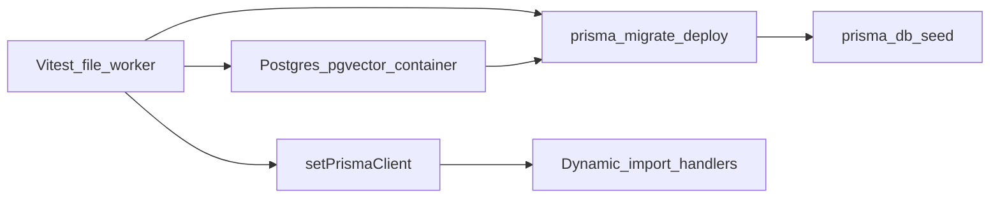

# Integration tests (tenant isolation)

Ephemeral Postgres per test file via [Testcontainers](https://testcontainers.com/), full `prisma migrate deploy` + `prisma db seed`, and `setPrismaClient()` from [`src/server/db.ts`](../../server/db.ts) so production code paths hit a real database.

## Prerequisites

- **Docker Desktop** running (Windows 11 / macOS / Linux).
- **Image:** `pgvector/pgvector:pg16` — **not** vanilla `postgres:16-alpine`. Migrations call `CREATE EXTENSION "vector"` (e.g. `20260324010435_add_pgvector_embedding_to_kb_chunks`). The integration container must match **production schema prerequisites**; this image is **test-only** and is not used by application runtime code.

## Quickstart

```bash
pnpm test:integration
# or
npm run test:integration
```

Combined unit + integration:

```bash
npm run test:all
```

Watch mode:

```bash
pnpm test:integration:watch
```

## Architecture



1. **`beforeAll`:** `startPostgresContainer()` → set `process.env.DATABASE_URL` / `DATABASE_DIRECT_URL` to the JDBC-style URI (random host port).
2. **`applyMigrations()`:** runs `node node_modules/prisma/build/index.js migrate deploy` then `db seed` (permissions, vendor roles, plans).
3. **`setPrismaClient(testPrisma)`:** routes all `import { prisma } from "@/server/db"` usage in dynamically loaded modules to the test client.
4. **Seeding:** `seedTwoTenants()` uses `createTenantForUser()` so roles, `ensureTenantRolesAndPermissions`, and financial config match production patterns.
5. **`afterAll`:** `clearPrismaClientOverride()`, `$disconnect()`, `container.stop()`.

### Import order (mandatory)

Integration test files **must not** statically import `@/server/*` or `@/app/*` at the top level (that loads [`src/lib/env.ts`](../../lib/env.ts) before `DATABASE_URL` is set).

1. `vitest` imports
2. `../_harness/auth-helpers-mocks` (first side-effect: `vi.mock` for NextAuth, etc.)
3. `_harness` helpers (no `@/server` in that graph)
4. Inside `beforeAll`: set env → `applyMigrations` → `setPrismaClient` → data seed
5. Inside `it` / `beforeAll` after DI: `await import("@/server/...")` as needed

`auth-helpers-mocks` is **not** re-exported from `_harness/index.ts` so mock registration order stays explicit.

### Vitest config

[`vitest.integration.config.mts`](../../../vitest.integration.config.mts): `pool: "forks"`, `fileParallelism: false` (one file at a time — avoids many parallel containers), `hookTimeout` / `testTimeout` for cold starts.

[`vitest.config.mts`](../../../vitest.config.mts) **excludes** `src/test/integration/**` so `npm test` stays fast and runs only unit tests (`*.test.ts` outside that folder).

## Adding a test (template)

1. Copy an existing `*.integration.test.ts` under `tenant-isolation/`.
2. Keep **`import "../_harness/auth-helpers-mocks"`** immediately after `vitest` imports.
3. Never add static `@/server` / `@/app` imports at file scope.
4. Use `resetDb(prisma)` when a file needs a clean slate after shared `beforeAll` work (optional).

## CI (future EPIC — not enabled in A6)

[`/.github/workflows/vercel-deploy.yml`](../../../.github/workflows/vercel-deploy.yml) currently runs **unit tests only** (`pnpm test`). To run integration tests in CI:

1. Use a Linux runner with Docker available (e.g. `ubuntu-latest` already has Docker).
2. Add a job step `pnpm test:integration` (or a dedicated job after unit tests).
3. Optionally cache the `pgvector/pgvector:pg16` image.
4. Expect **several minutes** per run due to migrations + seed per file (see Performance).

## Troubleshooting

| Issue | What to check |
|--------|----------------|
| `Could not find Docker` | Start Docker Desktop; on Windows, WSL2 backend. |
| Pull / image errors | Network; first pull of `pgvector/pgvector:pg16`. |
| `Invalid environment variables` | Ensure no static `@/server` import before env is set in `beforeAll`. |
| `spawnSync` / Prisma CLI | Harness uses `node node_modules/prisma/build/index.js` (Windows-safe). |
| Timeouts | Increase `hookTimeout` in `vitest.integration.config.mts` if machine is slow. |

## Performance (typical local run, observed)

Rough measurements from a full `pnpm test:integration` run (5 files, sequential):

| Phase | Order of magnitude |
|--------|---------------------|
| Container start | ~5–45s (first run / image cache) |
| `migrate deploy` (76 migrations) | ~10–30s |
| `db seed` | ~2–8s |
| `resetDb` (metadata `TRUNCATE`) | &lt;200ms |
| **Single test file** | ~27–50s wall time (cold) |
| **Full suite (5 files)** | ~200–220s |

Unit tests (`npm test`) remain ~15–25s and do not start Docker.

## Related code

- [`_harness/container.ts`](_harness/container.ts) — Testcontainers Postgres
- [`_harness/prisma-test-client.ts`](_harness/prisma-test-client.ts) — migrations + seed
- [`_harness/reset-db.ts`](_harness/reset-db.ts) — `pg_tables`-driven `TRUNCATE`
- [`_harness/seed-tenants.ts`](_harness/seed-tenants.ts) — `createTenantForUser` wrapper
- [`src/server/db.ts`](../../server/db.ts) — `setPrismaClient` / `clearPrismaClientOverride` / Proxy
